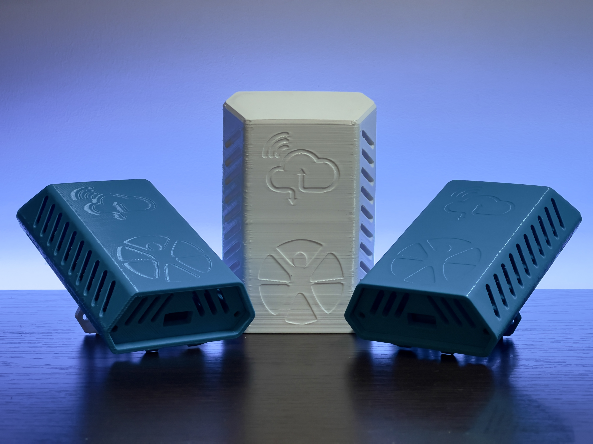

# **Klimerko Pro** Air Quality Monitoring Station

  

Klimerko Pro is a "non-DIY" variant of the [original Klimerko Air Quality Monitoring Device](https://github.com/DesconBelgrade/Klimerko) with some key differences:
- Uses custom-built PCB so assembling the device requires no soldering (if SMT assembly is used when ordering the PCB)
- Measures Sulfur dioxide (SO2) and Nitrogen dioxide (NO2) in addition to PM1, PM2.5 and PM10
- Doesn't use BME280 anymore as SO2 and NO2 sensors have temperature & humidity sensors built-in
- Uses ESP32 instead of ESP8266
- USB-C
- Redesigned housing
- Uses RockIoT Platform
  
> Klimerko Pro aims to be as simple as possible for the end user. As such, it isn't a device that's as easy to build as the original Klimerko was, nor does it aim to be.  
This documentation assumes you have the technical knowledge on how to build/order a PCB, how to use PlatformIO and more.

A quick-start guide for the end-user is available [here](/extras/Connecting%20Klimerko%20Pro.pdf) in the [extras](/extras) folder.  
All the files for PCB manufacturing and component sourcing are located in the [pcb](/pcb) folder.  
STL files for printing the housing are located in the [housing](/housing) folder.  
Photos of the complete device are available in the [photos folder](/extras/photos).  
The latest hardware revision of Klimerko Pro PCB is v1.1.1.  

# Table of contents

- [Overview](#overview)
  - [Data](#data)
    - [Sensor Data Collection](#sensor-data-collection)
    - [Sensor Data Averaging](#sensor-data-averaging)
    - [Sensor Data Publishing](#sensor-data-publishing)
    - [Metadata](#metadata)
  - [WiFi Configuration Mode](#wifi-configuration-mode)
  - [Over-The-Air (OTA) Firmware Updates](#over-the-air-ota-firmware-updates)
    - [Automatic OTA Updates](#automatic-ota-updates)
    - [Manual OTA Updates](#manual-ota-updates)
  - [Sensor Warm-Up](#sensor-warm-up)
  - [Sensor Zeroing](#sensor-zeroing)
  - [LED Light](#led-light)
  - [Device behavior when a sensor failed or is missing](#device-behavior-when-a-sensor-failed-or-is-missing)
    - [If a sensor is not installed](#if-a-sensor-is-not-installed)
    - [If a sensor is removed or fails during operation](#if-a-sensor-is-removed-or-fails-during-operation)
    - [If a sensor comes back online during operation](#if-a-sensor-comes-back-online-during-operation)
    - [If you replace the sensor during operation (only applies to DGS-SO2 and DGS-NO2)](#if-you-replace-the-sensor-during-operation-only-applies-to-dgs-so2-and-dgs-no2)
  - [Libraries Used](#libraries-used)
- [Configuration and Usage](#configuration-and-usage)
  - [Flashing Firmware via Serial](#flashing-firmware-via-serial)
  - [Flashing Firmware via OTA](#flashing-firmware-via-ota)
  - [Entering WiFi Configuration Mode](#entering-wifi-configuration-mode)
  - [Connecting Klimerko Pro to WiFi](#connecting-klimerko-pro-to-wifi)
  - [Connecting Klimerko Pro to the platform](#connecting-klimerko-pro-to-the-platform)
  - [Resetting WiFi Credentials](#resetting-wifi-credentials)
  - [Zeroing Sensors](#zeroing-sensors)

# Overview
This part of the README goes in detail on how the device works and explains its internal logic.  
Skip to [Configuration and Usage](#configuration-and-usage) to get to practical stuff.

## Data
### Sensor Data Collection
Klimerko Pro collects data from all available sensors every 6 seconds.
The data that is being read (not sent) includes:

- PMS7003 Sensor availability (if the sensor is connected or not/if the data request failed and if so, how many times it failed)
- PM1 from PMS7003 Sensor
- PM2.5 from PMS7003 Sensor
- PM10 from PMS7003 Sensor
- DGS-SO2 sensor availability (if the sensor is connected or not/if the data request failed and if so, how many times it failed)
- SO2 current concentration in PPB (Parts Per Billion) from the DGS-SO2 sensor
- SO2 current concentration in μg/m³ (micro grams per cubic meter), calculated using the PPB value, SO2 molar mass and the current temperature.
- SO2 current concentration in raw (ADC) format, the way it's read by the sensor circuitry
- Temperature from the DGS-SO2 sensor with offset applied
- Temperature from the DGS-SO2 sensor in Digital (raw) format, the way it's read by the sensor circuitry
- Humidity from the DGS-SO2 sensor with offset applied
- Humidity from the DSG-SO2 sensor in Digital (raw) format, the way it's read by the sensor circuitry
- DGS-SO2 sensor uptime (Days, Hours, Minutes and Seconds)
- DGS-SO2 sensor serial number
- DGS-NO2 sensor availability (if the sensor is connected or not/if the data request failed and if so, how many times it failed)
- NO2 current concentration in PPB (Parts Per Billion) from the DGS-NO2 sensor
- NO2 current concentration in μg/m³ (micro grams per cubic meter), calculated using the PPB value, NO2 molar mass and the current temperature.
- NO2 current concentration in raw (ADC) format, the way it's read by the sensor circuitry
- Temperature from the DGS-NO2 sensor with offset applied
- Temperature from the DGS-NO2 sensor in Digital (raw) format, the way it's read by the sensor circuitry
- Humidity from the DGS-NO2 sensor with offset applied
- Humidity from the DSG-NO2 sensor in Digital (raw) format, the way it's read by the sensor circuitry
- DGS-NO2 sensor uptime (Days, Hours, Minutes and Seconds)
- DGS-NO2 sensor serial number

### Sensor Data Averaging
Relevant sensor data collected by Klimerko Pro is averaged for better accuracy. 
The data points for averaging are collected every 6 seconds (as stated in [Sensor Data Collection](#sensor-data-collection)) and the final value that gets sent is the average of all data points collected since the last data publish.

The following values are averaged:
- PM1
- PM2.5
- PM10
- SO2 concentration in μg/m³
- Temperature from DGS-SO2
- Humidity from DGS-S02
- NO2 concentration in μg/m³
- Temperature from DGS-NO2
- Humidity from DGS-NO2

### Sensor Data Publishing
Klimerko Pro publishes sensor data (not to be confused with metadata) every 60 seconds. 
The payload includes the following:

- Current time and date (UTC)
- Klimerko Pro ID
- SO2 average concentration in μg/m³
- NO2 average concentration in μg/m³
- SO2 sensor availability (online/offline)
- NO2 sensor availability (online/offline)
- PM1 average concentration in μg/m³
- PM2.5 average concentration in μg/m³
- PM10 average concentration in μg/m³
- Average temperature, collected from the DGS-NO2 module (for accuracy since that sensor closest to the vents), and if DGS-NO2 isn't available, average temperature collected from the DGS-SO2 module is sent.
- Average humidity, collected from the DGS-NO2 module (for accuracy since that sensor closest to the vents), and if DGS-NO2 isn't available, average humidity collected from the DGS-SO2 module is sent.

### Metadata
In addition to sensor data being sent, Klimerko Pro also collects and sends metadata. Metadata is sent:
- Every 15 minutes during operation.
- The first time the device connects to the platform
- Every time the device re-connects to the platform
- Every time a sensor comes online (but was previously offline)
- If any sensor goes offline during operation
- If a new serial number of a sensor is detected (e.g. sensor replaced)
- Every time a sensor is zeroed.
- Every time zeroing data is erased.

Metadata payload contains:
- Klimerko Pro Unique ID
- Time and date in UTC
- Klimerko Pro firmware version
- Klimerko Pro active time (how long the device has been active)
- WiFi signal strength in RSSI
- ESP32 free heap
- ESP32 flash size
- ESP32 memory used by the firmware
- ESP32 total memory available for the firmware
- Time and date of the last successful OTA update in UTC
- Time and date of the last failed OTA update in UTC
- Last device power on/reset reason
- Sensor data read interval
- Sensor data publish interval
- DGS-SO2 availability (online/offline)
- DGS-SO2 readiness (if enough time has passed since the sensor came online for it to be stabilised)
- DGS-SO2 active time (how long the sensor has been powered on)
- DGS-SO2 serial number
- DGS-SO2 firmware version
- Time and date of last successful DGS-SO2 zeroing in UTC
- Time and date of last failed DGS-SO2 zeroing in UTC
- DGS-NO2 availability (online/offline)
- DGS-NO2 readiness (if enough time has passed since the sensor came online for it to be stabilised)
- DGS-NO2 active time (how long the sensor has been powered on)
- DGS-NO2 serial number
- DGS-NO2 firmware version
- Time and date of last successful DGS-NO2 zeroing in UTC
- Time and date of last failed DGS-NO2 zeroing in UTC
- PMS7003 sensor availability (online/offline)

## WiFi Configuration Mode
WiFi Configuration Mode is a feature of Klimerko Pro where the device itself becomes an access point (simulates a WiFi router) so you can connect to it using your computer or smartphone in order to configure it or upload a custom firmware to it.  
> In further text, "WiFi Configuration Portal" refers to the web page that opens once you connect to a Klimerko Pro using your computer or a smartphone while it's in WiFi Configuration Mode.

If Klimerko Pro has no WiFi credentials stored in its memory, it will automatically enter WiFi Configuration Mode in order to let you configure it without the need to open the housing.
WiFi Configuration Expires after X minutes if there's no interaction.

## Over-The-Air (OTA) Firmware Updates
Firmware updates are an important part of almost every device, Klimerko Pro included. It can fix security issues, improve functionality and improve stability of the device.

### Automatic OTA Updates
Klimerko Pro will automatically update itself by checking for new firmware releases every 1h30m and comparing its firmware version to the one that's available online. If there's a new firmware available, it will: 

1. Establish a secure connection to the server (TLS - to avoid MITM attacks) 
2. Download and store the new firmware
3. Update itself
4. Reboot itself
5. Continue normal operation with new firmware installed

In case something happens while the firmware is being updated (e.g. the WiFi connection drops or the server becomes unavailable), the device will:

1. Wait 90 seconds to see if the connection resumes
2. Restart itself if it doesn't
3. Continue normal operation without any changes to its firmware and keep checking for firmware updates
4. Repeat the firmware update process if the server becomes available again

### Manual OTA Updates
Klimerko Pro also supports manual OTA updates by utilizing [WiFi Configuration Mode](#wifi-configuration-mode).  
There are some cases where you might want to flash a new firmware to the device manually:
- A custom firmware is required for that specific device
- You modified the firmware and want to test it out on your own device
- You have no network access but want/need to update one or more devices to the newest firmware
- You disabled [Automatic OTA updates](#automatic-ota-updates) and wish to update the firmware yourself by downloading the [binary file](/firmware/firmware.bin).

For details on how to perform manual OTA updates, check the [Flashing Firmware via OTA](#flashing-firmware-via-ota).

## Sensor Warm-Up
> This only applies to DGS-NO2 and DGS-SO2 sensors.

Because of their chemistry, the NO2 and SO2 sensors present in Klimerko Pro need some time to warm-up in order to stabilize their readings.  
This process takes about 3 hours each time the sensor is powered on (or plugged into Klimerko Pro).  
Klimerko Pro is fully aware of the amount of time each sensor has been powered on and it reports that data (how long the sensor has been powered on + if it completed the warm-up process) in the [metadata payload](#metadata).  

## Sensor Zeroing
> This only applies to DGS-NO2 and DGS-SO2 sensors, and **not** the PMS7003, as it doesn't require zeroing.  

> Sensor zeroing can only be done after the sensor has [warmed up](#sensor-warm-up).

The SPEC-Sensors DGS-NO2 and DGS-SO2 present on Klimerko Pro **require** zeroing before they can output useful readings.  
Zeroing is a process where the device is placed in a pollutant-free (or as pollutant-free as possible) environment for a period of time after which the user sends the command to zero the sensor, practically telling it whatever it currenly "senses" should be a value of 0 (Zero).  
Ideally, you should place Klimerko Pro in a closed space with low levels of NO2 and SO2 concentration for at least 24 hours before zeroing. It is worth noting that the more time passes before zeroing, the better.  
If this isn't possible, you can install the device in its final location and zero it once the said time period has passed.  
The sensor will store the zeroing information in its own independant memory, which isn't tied to a specific Klimerko Pro device. Klimerko Pro, however, will store the precise time and date of the newest "zeroing" event (along with the serial number of the sensor) in its own memory and report it back in a [metadata payload](#metadata) as well.  
Replacing the sensor will cause Klimerko Pro to erase the zeroing event data from its own memory, [as explained here](#if-you-replace-the-sensor-during-operation-only-applies-to-dgs-so2-and-dgs-no2).  
The zeroing process can be repeated as many times as deemed fit.

> **NOTE:** NO2 and SO2 sensors have their own internal logic that defines if their readings are stable enough for them to be zeroed. In case the user tries to zero the sensor before its internal logic decides that it's "stable enough", it will fail to zero itself and will return an error. The error, including the precise time and date (in UTC) is reported via the [metadata payload](#metadata).

## LED Light
Klimerko Pro PCB is equipped with an RGB LED that is meant to help you understand what’s going on with the device at a glance:

| Light Behavior | Explanation |
|----------------|-------------|
| Quick Green-Blue-Red Blink *(<1 second total)* | Device has just booted, meaning it was either plugged into power or reset for any reason (the device can reset on its own, for example when updating its firmware). |
| Constant Blue Light | The device is currently in WiFi Configuration Mode and you can connect to it using WiFi on your smartphone or a computer. |
| Quick Green Blink *(<2 seconds total)* | The device has successfully connected to either WiFi or the RockIOT Platform. |
| Constant Slow Red Blinking *(1.5 seconds on, 1.5 seconds off)* | Device is not connected to WiFi. |
| Constant Faint Yellow Blinking *(0.8 seconds on, 0.8 seconds off)* | Device is not connected the RockIOT platform. |
| Erratic Magenta/Pink Blinking | Device is downloading a firmware update and will restart and return to normal operation shortly. **DO NOT** power the device off. |

## Device behavior when a sensor failed or is missing

Klimerko Pro can handle situations where there's a sensor missing. It will work and report metadata even if there's no sensors connected at all - though that would be an extreme situation. 

Klimerko Pro is fully aware of all the sensors connected to it and is able to initialize and deinitialize sensors on the fly (during runtime) without any service interruption or reboots (though it is not recommended to replace sensors while the device is in operation).  
This feature exists for cases where the connection between the main PCB and the sensors isn't stable (corrosion, not plugged all the way in, damage during transport, etc) as well as cases when it's not possible to obtain all the sensors (*cough* chip shortage *cough*).  
As stated in [Metadata reporting](#metadata), Klimerko Pro reports the state of each sensor.  
The following explains how the device functions in these situations:  

### If a sensor is not installed:
1. On boot, Klimerko Pro will try to initialize all the sensors.
2. If one or more sensors are not replying, Klimerko Pro will try to initialize them a few times before it considers them offline.
3. Metadata containing the state of all sensors is sent, reporting the failed (and working) sensors.
4. The part of the [sensor data payload](#sensor-data-publishing) that's supposed to contain values from the failed sensor is now omitted.
5. Klimerko Pro will attempt to initialize the sensor(s) every 2 data sending intervals, which converts to every 120 seconds.

### If a sensor is removed or fails during operation:
1. Klimerko Pro will detect that the sensor is not giving any readings and mark it as "failing", but will not report the incident or consider it offline yet.
2. If a sensor comes back online on the next reading attempt, everything will continue to work as usual.
3. However, if the sensor fails to respond 3 times in a row, the sensor is marked as offline and metadata, containing the information of which sensor failed, will be sent.
4. Averaging data for that specific sensor will be reset. This is to avoid including stale datapoints for averaging in case the sensor comes back online later.
5. Klimerko Pro will attempt to initialize the sensor(s) every 2 data sending intervals, which converts to every 120 seconds.
6. The part of the [sensor data payload](#sensor-data-publishing) that contains values from the failed sensor is omitted until the sensor comes back online.

### If a sensor comes back online during operation:
1. If you just plugged the sensor in, or the sensor "came back to life", Klimerko Pro will detect it in less than 4 minutes and automatically re-initialize the sensor.
2. Metadata payload will be generated and sent to the platform. 
3. Since the sensor is now online, the previously omitted part of the [sensor data payload](#sensor-data-publishing) that contained values from this sensor will now be included in the next payload. 

### If you replace the sensor during operation (only applies to DGS-SO2 and DGS-NO2):
1. Once you unplug the respective sensor, Klimerko Pro will most likely (if you're not quick enough) behave the same as detailed above in *["If a sensor is removed or fails during runtime"](#if-a-sensor-is-removed-or-fails-during-operation)*.  
However, if you're quick enough and change the sensor without Klimerko Pro "noticing" it (marking it as offline), the procedure will happen from the step below (step 2).
2. Once you plug a new sensor, Klimerko Pro will detect that the serial number isn't the same as before (it does this by storing all sensors' serial numbers in its own memory).
3. Klimerko Pro will store the serial number of the newly installed sensor in its memory.
4. The sensor zeroing information stored in Klimerko Pro (last successful zeroing and last failed zeroing time and date) will be erased for that specific sensor.
4. Averaging data for that specific sensor will be reset. This is to avoid including stale datapoints (from the previous sensor).
5. The sensor will be marked as "not ready" as it needs time to warm up (explained in [Sensor Warm-Up](#sensor-warm-up))
6. A metadata report, which contains the serial number of the newly installed sensor and the "readiness" of the sensor, will be sent.

## Libraries Used
- [WiFi Manager](https://github.com/tzapu/WiFiManager) by Tzapu  
- [Uptime Library](https://github.com/YiannisBourkelis/Uptime-Library) by Yiannis Bourkelis
- [PubSubClient](https://github.com/knolleary/pubsubclient/) by Nick O'Leary
- [PMSerial](https://github.com/avaldebe/PMserial) by Alvaro Valdebenito 
- [EspSoftwareSerial](https://github.com/plerup/espsoftwareserial) by Peter Lerup
- [MovingAvg](https://github.com/JChristensen/movingAvg) by Jack Christensen
- [Taranais' fork of NTP Client](https://github.com/taranais/NTPClient/blob/master/NTPClient.h) by Arduino
- [ArduinoJson](https://github.com/bblanchon/ArduinoJson) by Benoît Blanchon
- [FastLED](https://github.com/FastLED/FastLED)

# Configuration and Usage
This part of the README dives into practical things. It is recommended to read the [Overview](#overview) first.

## Flashing Firmware via Serial
If the ESP32 is "empty" (doesn't have Klimerko Pro firmware already installed), the only way for you to flash the firmware onto it is by using the Serial port.  
Fortunately, Klimerko Pro has a built-in CP2012 USB to Serial converter, which means you can flash the ESP32 chip just by plugging a USB-C cable into Klimerko Pro and plugging the other end into your computer.  

The procedure is as follows:

1. Install Visual Studio Code (if you don't have it already)
2. Install PlatformIO addon for Visual Studio Code (if you don't have it already)
3. Install ESP32 Board Definition
4. Download this repository from GitHub
5. In PlatformIO, select "Open"
6. Click "Open Project"
7. Navigate to the "firmware" folder of this repository and open it
8. Plug Klimerko Pro into your computer **WHILE** holding the "PROG" button on the board (this puts it in programming mode)
9. Check the "platformio.ini" file to see if the "monitor_port" and "upload_port" match with the port your Klimerko Pro is connected to on your computer
10. Click the "PlatformIO Upload" button in the bottom right corner of Visual Studio Code
11. Click the "RST" button on Klimerko Pro's board and the device will boot up

## Flashing Firmware via OTA
> If you've modified the firmware and want to test it, make sure you've disabled Automatic OTA updates by commenting out relevent lines of code before uploading your custom firmware to the device.  

In case you want/need to flash Klimerko Pro manually without establishing a physical connection to it, you can do so using the WiFi Configuration Mode:

1. Make sure the firmware you're going to upload is present on the device you're using to connect to the device.
2. [Enter WiFi Configuration Mode](#entering-wifi-configuration-mode).
3. Connect to your Klimerko Pro device using WiFi.
4. Once the WiFi Configuration Portal opens, go to "Info".
5. Find and click the "Update" button (bottom of the page).
6. Click "Choose File" and choose the **.bin** file you wish to flash the Klimerko Pro with.
7. Once you've selected the file, click the red "Update" button and wait for the firmware to be uploaded to Klimerko Pro.
8. Once the firmware is uploaded, Klimerko Pro will reboot and it will be running the firmware you uploaded to it.

## Entering WiFi Configuration Mode
As explained in the overview section above, the WiFi Configuration Mode allows you to configure Klimerko Pro wirelessly without a physical connection to the device.  

> Note: Klimerko Pro will automatically enter WiFi Configuration Mode when plugged into power **if it doesn't** have any WiFi credentials stored in its memory.

Follow these steps in order to enter WiFi Configuration Mode:  

1. Make sure the USB-C cable is unplugged from the device.
2. Open the housing by removing the 2 phillips screws at the bottom of the device.
3. Remove the bottom plate/piece that the screws were holding.
4. Remove the PCB (Board) by tilting the case upwards.
5. Power on the device by plugging the USB-C cable into the board.
6. Press and hold the button marked with a WiFi signal sign (located below the RST and PROG buttons) on the board until you see the LED turn solid blue.
7. Using your computer or a smarphone, scan for WiFi networks and connect to the "KLIMERKO-XXXXXXXXXXXX" network (where the X's are the serial number of the Klimerko Pro) using password "**ConfigMode**".
8. Once connected, the WiFi Configuration Portal should automatically open on your computer/smartphone.  
If it doesn't (but you're connected to Klimerko Pro), go to [http://192.168.1.4](http://192.168.1.4) using your web browser in order to open the WiFi Configuration Portal.

> You can exit WiFi Configuration Mode by qucikly pressing the WiFi Configuration Mode button on the board (PCB) or just by clicking "Exit" in WiFi Configuration Portal.

## Connecting Klimerko Pro to WiFi
> To configure the whole device in one go, first [configure the platform credentials](#connecting-klimerko-pro-to-the-platform) and then just go back and configure WiFi (explained below). This way you don't have to enter WiFi Configuration Mode twice.

To provide Klimerko Pro with an internet connection, you need to tell it the credentials of your WiFi network. This is done using WiFi Configuration Mode:

1. [Enter WiFi Configuration Mode](#entering-wifi-configuration-mode)
2. In WiFi Configuration Portal, click "Configure WiFi" and wait a few seconds.
3. You will see a list of nearby WiFi networks, from which you can choose the only you want Klimerko Pro to connect to.
4. Select a network and enter the password for that network.
5. Click "Save".
6. Klimerko Pro will now try to connect to that WiFi network. Once it does, the solid blue light will go off (indicating it exited WiFi Configuration Mode) and a few brief green blinks will notify you that the device has successfully connected to WiFi.  

If the solid blue light doesn't go off, the device most likely didn’t connect to the WiFi network because of a bad password, weak signal or some other issue. If the solid blue light is still on, the WiFi Configuration Portal is still active, so you can go back and try to connect it to WiFi again.

## Connecting Klimerko Pro to the platform
> This assumes have already obtained your device credentials from RockIoT platform
Klimerko Pro needs a way to authenticate itself to the RockIoT Platform. This, as well, is configured using WiFi Configuration Mode:

1. [Enter WiFi Configuration Mode](#entering-wifi-configuration-mode)
2. In WiFi Configuration Portal, click "Setup". You will a field "Platform Password" with "do not change unless instructed" in the field.
3. Delete the existing "do not change unless instructed" and replace it with your platform password.
4. Click "Save" and a new screen showing "Saved" will open.
5. If you already configured WiFi credentials, Klimerko Pro will immediately connect to the RockIoT platform. If not, proceed to configure WiFi credentials.

## Resetting WiFi Credentials
There are cases where you might want to erase WiFi credentials from the device in order to get it to automatically start in WiFi Configuration Mode as soon as it's plugged in. This simplifies the experience for the end user/installer.  
In order to do this: 

1. Go to RockIoT platform device management
2. Find the device you wish to erase the WiFi credentials of
3. Click the checkbox on the left side of the device row
4. In "Action" dropbox menu, select "Send Event" and click "Go"
5. Once the "Select an event to send to device" page opens, select "Erase WiFi Credentials" from the dropdown menu
6. Click "Confirm"

## Zeroing Sensors
In order to zero a sensor (or both NO2 and SO2 sensors), do the following:

1. Go to RockIoT platform device management
2. Find the device you wish to zero
3. Click the checkbox on the left side of the device row
4. In "Action" dropbox menu, select "Send Event" and click "Go"
5. Once the "Select an event to send to device" page opens, select an event from the dropdown menu (Zero Sensors, Zero SO2 or Zero NO2)
6. Click "Confirm"

After a few moments, you can go and check the device's Metadata field to see if the Zeroing succeeded.